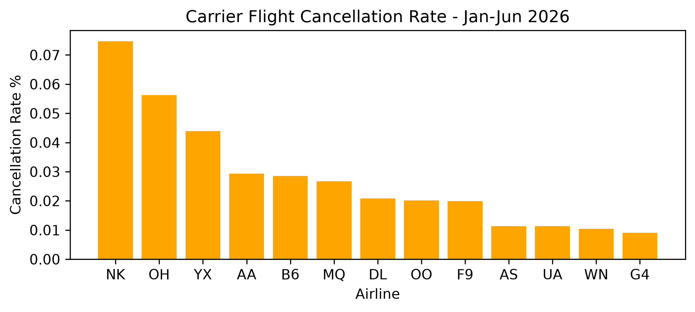
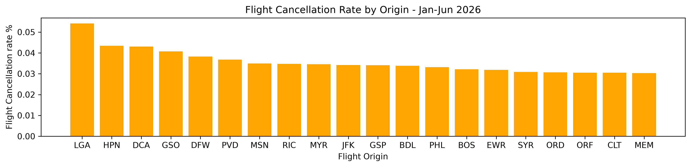
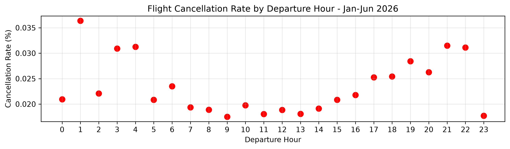
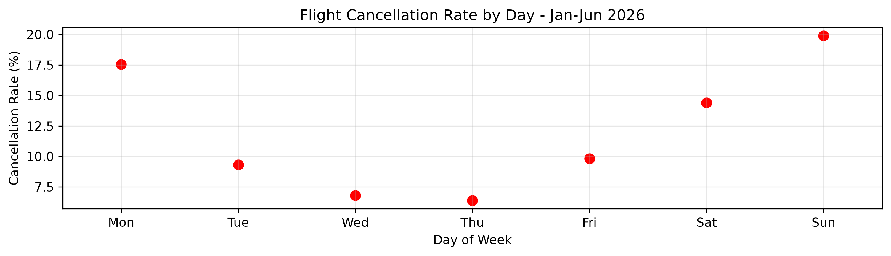

## USA Flight Cancellation Analysis — January–June 2026

### Project Overview
This project analyzes flight cancellations across the United States (USA) from January–June 2026). The objective is to identify patterns cancellation and determine whether cancellation rates differ according to factors such as airline, origin airport, route, departure time, day of the week, and month. The analysis was performed using Python, Pandas, and Matplotlib to transform a large U.S. flight dataset into meaningful operational insights.

### Data Source
The data used in this project comes from the U.S. Department of Transportation (USDOT), Bureau of Transportation Statistics (BTS). The dataset contains information about scheduled flights operating within the United States, including flight dates, airlines, origin and destination airports, departure times, and cancellation status.

Data Period [January 2026 – June 2026]
Geographic Scope [United States (USA)]

### Key Variables Used
- FL_DATE — Flight date
- DAY_OF_WEEK — Day of the week
- MONTH — Month
- DEP_HOUR — Scheduled departure hour
- ORIGIN — Origin airport
- DEST — Destination airport
- OP_CARRIER — Operating carrier
- CANCELLED — Flight cancellation indicator

### Objectives

The main objectives of this analysis were to:
- Measure flight cancellation rates across the USA.
- Compare cancellation rates between airlines.
- Identify U.S. airports with higher cancellation rates.
- Investigate cancellation patterns by departure hour.
- Examine cancellation rates across different days of the week.
- Analyze monthly changes in U.S. cancellation rates.
- Identify areas where cancellation risk appears to be concentrated.

### Tools & Technologies

- Python 3, Pandas, Matplotlib
- Git & GitHub — project documentation and version control

### Key Findings

## 1. Cancellation Rates Differ by Airline
The analysis shows that cancellation rates are not evenly distributed across U.S. airlines. Some carriers have noticeably higher cancellation rates than others, indicating that airline-specific operational factors may influence the likelihood of a flight being cancelled.

#### Insight
Cancellation risk varies across U.S. carriers, suggesting that airline-level operational performance may be an important factor in flight reliability.

## 2. Cancellation Rates Differ by Origin Airport
Cancellation rates also vary considerably between U.S. departure airports. Some airports show higher cancellation rates than others, suggesting that airport-level factors may contribute to flight disruptions.
Possible factors include Airport congestion, Weather conditions, Operational capacity, Traffic volume, and Local scheduling patterns.

#### Insight
Flight cancellations are geographically concentrated, with some U.S. origin airports experiencing higher cancellation rates than others.

## 3. Evening Flights Have Higher Cancellation Rates
U.S. flight cancellation rates vary by departure hour. Among hours with substantial flight volumes, cancellation rates are generally higher during the late afternoon and evening, rising from about 5 PM and reaching their highest levels around 9–10 PM. The rate peaks at 3.15% at 9 PM and 3.11% at 10 PM.
 
Although 1 AM has the highest overall rate (3.64%), it is based on only 1,869 flights, compared with more than 100,000 flights at 9 PM. Therefore, the late-evening pattern provides a more meaningful observation than the isolated overnight peaks.

The data indicates that departure hour is associated with cancellation rate, but this analysis alone does not determine the underlying cause.
 
#### Insight

Flight cancellation rates tend to be higher during the late afternoon and evening, particularly from 5 PM to 10 PM. The strongest evidence is:
5 PM → 2.08%, 6 PM → 2.54%, 7 PM → 2.84%, 8 PM → 2.63%, 9 PM → 3.15%, and 10 PM → 3.11%

## 4. Cancellation Rates Follow a Weekly Pattern
The strongest observation is that flight cancellation rates are substantially higher at the beginning and end of the week, especially on Sunday and Monday, and lowest from Wednesday through Friday.
- Sunday: 3.90% — highest
- Monday: 3.42%
- Saturday: 2.31%
- Tuesday: 1.83%
- Friday: 1.54%
- Wednesday: 1.12%
- Thursday: 1.01% — lowest

## 5. Cancellation Rates Vary Across Routes
Cancellation rates also differ across U.S. flight routes. Some origin-destination combinations experience more cancellations than others, showing that cancellation risk is not evenly distributed throughout the U.S. flight network.
Insight
Certain U.S. routes appear to carry higher cancellation risk, indicating that route-level analysis can reveal patterns that overall cancellation statistics hide.

## 6. Cancellation Rates Vary Significantly by Month
The monthly analysis produced one of the clearest temporal patterns in the U.S. flight data.
|Month|	Flights|Cancellations|	Cancellation Rate|
|---|---:|---:|---:|
|January|	544,003|	25,635|	4.71%|
|February|	515,037|	11,605|	2.25%|
|March|	612,102|	17,766|	2.90%|
|April|	597,919|	5,402|	0.90%|
|May|	611,735|	5,655|	0.92%|
|June|	607,577|	10,019|	1.65%|

January had the highest cancellation rate at 4.71%.
The rate dropped substantially in February, increased again in March, and then fell below 1% in April and May before increasing slightly in June.
#### Insight

January experienced the highest U.S. flight cancellation rate, while cancellation rates were substantially lower during April and May, indicating significant variation across the first half of 2026.

### Conclusions
The analysis demonstrates that U.S. flight cancellations are not randomly distributed. Cancellation rates vary according to several dimensions:
Airline → Airport → Route → Departure Time → Day of Week → Month

The strongest temporal patterns were:
- January had the highest monthly cancellation rate.
- Sunday and Monday had the highest weekly cancellation rates.
- Evening flights, particularly around 9–10 PM, showed higher cancellation rates.
- Some U.S. airports and routes experienced substantially higher cancellation rates than others.
- Cancellation rates differed considerably between airlines.

These patterns suggest that cancellation risk is influenced by a combination of temporal, geographic, route-level, and airline-specific factors.

### Business Implications
The findings could be useful for airlines, airports, and passengers in the U.S. aviation industry. Airlines could investigate high-risk departure periods and routes to identify operational bottlenecks.
U.S. airports with consistently high cancellation rates could be examined for congestion, capacity, weather, or other operational issues.

Passengers may benefit from understanding that cancellation risk can vary depending on the day, departure time, airline, airport, and route.
A predictive model could be developed to estimate the probability that an individual U.S. flight will be cancelled.

Potential features could include:
- Airline
- Origin airport
- Destination airport
- Departure hour
- Day of week and Month
- Route
- Scheduled departure time
- Historical cancellation rate

### Future Work
The next stage of the project could involve building a machine learning classification model to predict whether a U.S. flight will be cancelled. Possible models include: Logistic Regression, Decision Tree, Random Forest, and XGBoost
### Project Structure
- notebooks/
    - jan-Jun-us-flight-cancelled.ipynb
- images/
    -	cancellation_balance.png
    -	cancellation_by_departure_hour.png
    -	cancellation_carrier.png
    -	montly_cancellation.png
    -	origin_cancellation.png
    -	rate_by_date.png
- README.md

### Cancellation Rate Calculation
cancellation_rate = cancellations / total_flights
For example, the day-of-week analysis was created using:
days = df.groupby('DAY_OF_WEEK').agg({
    'FL_DATE': 'count',
    'CANCELLED': 'sum'
})

days['cancellation_rate'] = (
    days['CANCELLED'] / days['FL_DATE']
)
This calculates the total number of flights and cancellations for each day and then determines the proportion of flights that were cancelled.

### Conclusion
U.S. flight cancellations during January–June 2026 show clear patterns across airlines, airports, routes, departure times, days of the week, and months. The highest cancellation risk was observed in January, on Sundays and Mondays, and during evening departure hours.
This analysis demonstrates how exploratory data analysis (EDA) can uncover operational patterns hidden within a large U.S. aviation dataset and provide a foundation for future flight-cancellation prediction.

